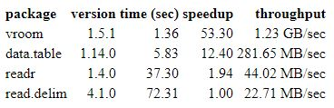

# Some Tips for Programming
Created by: Yazdan Asgari<br>
Creation date: 17 Jun 2022<br>
Update: Jun 2022<br>
https://cesp.inserm.fr/en/equipe/exposome-and-heredity
<br>
<br>

## Contents
- [Calculation of Very Very Small Values for P-value based on beta and se](#calculation-of-very-very-small-values-for-p-value-based-on-beta-and-se)
  * [Python](#python)
  * [R](#r)
- [VROOM a Fast Way to read_or_write Big Text Data in R](#vroom-a-fast-way-to-read-or-write-big-text-data-in-r)


## Calculation of Very Very Small Values for P-value based on beta and se
If there is no column for **P_value** in the original GWAS Summary Statistics data, **P-value** could be calculated based on **beta** and **se** using **chi2** distribution. <br>
But if you use the basic function, it ignores very very small values for P-value and set it to zero. In order to calculate very very small P-values (vary large z values), you need to use the following equations in **Python** or **R**. 
### Python
```python
from scipy.stats.distributions import chi2
p = chi2.sf( (beta/se)**2, 1 )
```
Example:
```python
beta = -0.246192				
se = 0.00802599	
z2 = (beta/se)**2
chi2.sf(z2,1)
1.251669043223986e-206
```
### R
```R
p <- pchisq( (beta/se)**2, 1, lower.tail = FALSE )
```
Example:
```R
beta <- -0.246192				
se <- 0.00802599	
z2 <- (beta/se)**2
pchisq(z2, 1, lower.tail = FALSE)
1.251669e-206
```
## VROOM a Fast Way to read or write Big Text Data in R
If you work with big text data files, one of the best and fast way to read/write them is using "vroom" library in R. Here is the comparison of some R commands and **vroom** functions [[Ref]](https://cran.r-project.org/web/packages/vroom/readme/README.html):
<div align="center">
<kbd>
  
</kbd>
</div>
<br></br>

## dplyr R Library for Fast Operations
Consider a dataframe #1 with 5e5 rows and a dataframe #2 with 1e5 rows. 
<br>
For example, working on this data, **match** and **apply** methods took around **74 seconds** while **dplyr** took **0.3 seconds**. So, for working with large dataframes, it is recommended to use functions inside **dplyr** library.
<br>
In addition, to merge data, it is recommended to use different **join** functions of the **dplyr** library (such as inner_join, left_join, right_join, full_join, semi_join, anti_join).
<br>
Or you could use **tidyverse** which includes the **dplyr** and some other useful libraries (such as ggplot2, tidyr, tibble, etc.) in its core.


